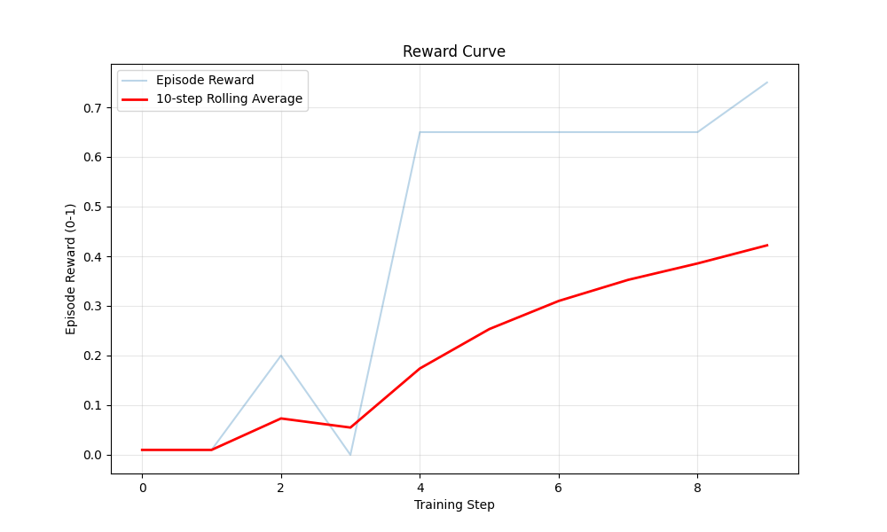
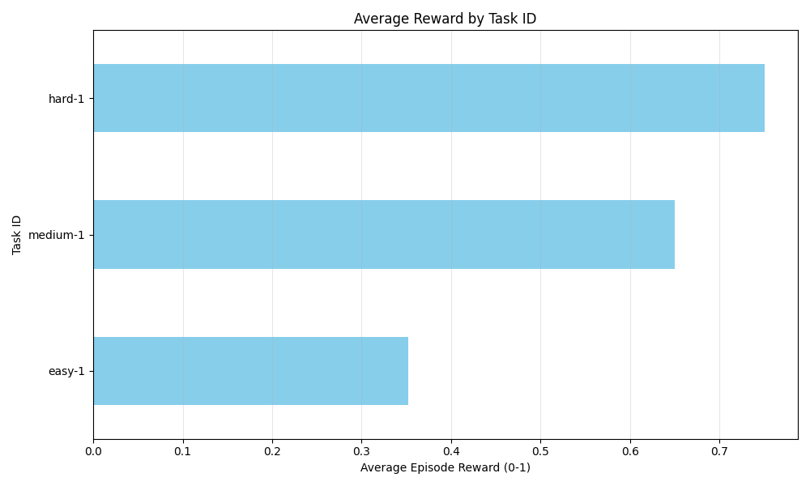
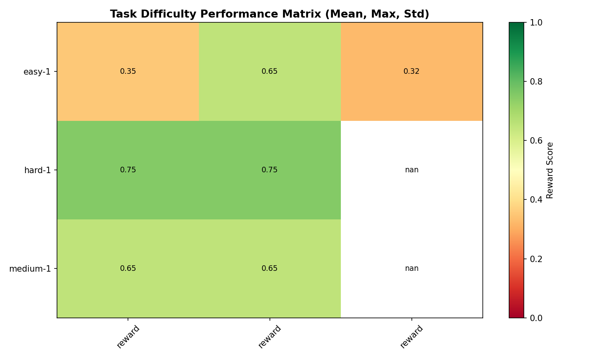
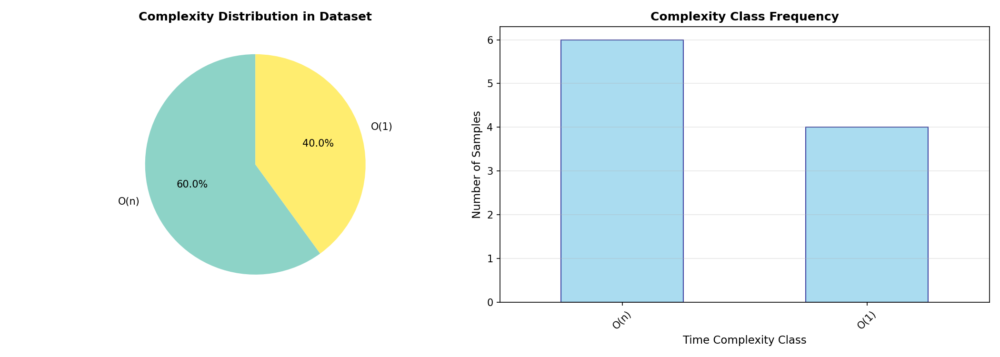
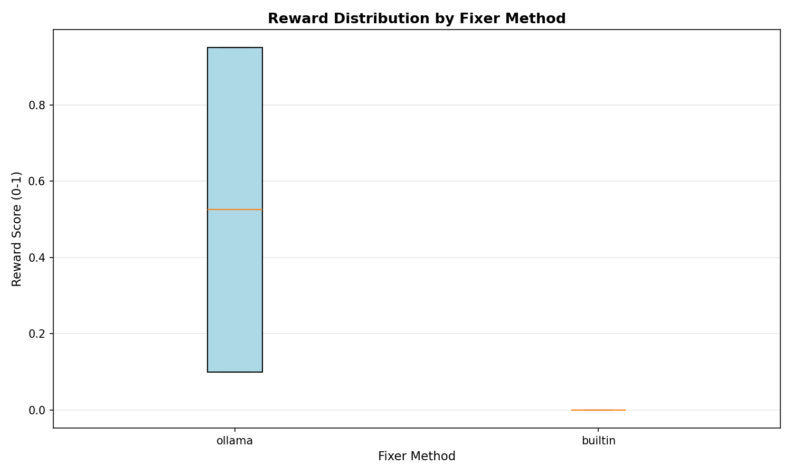
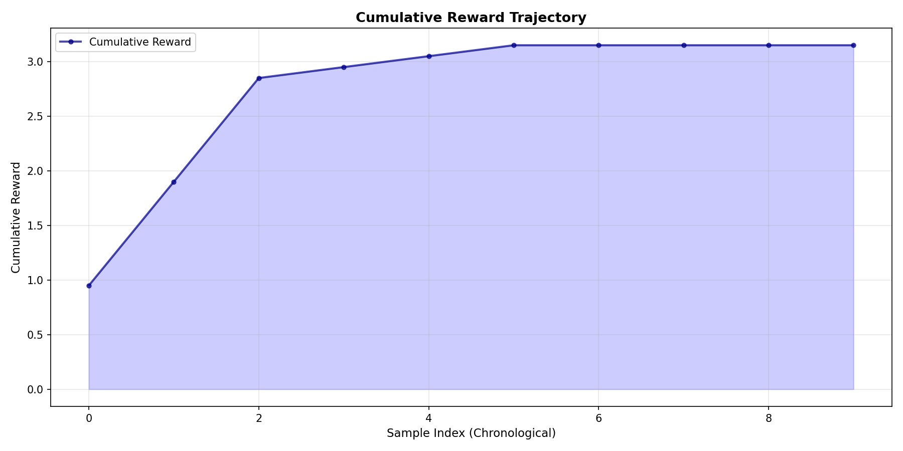
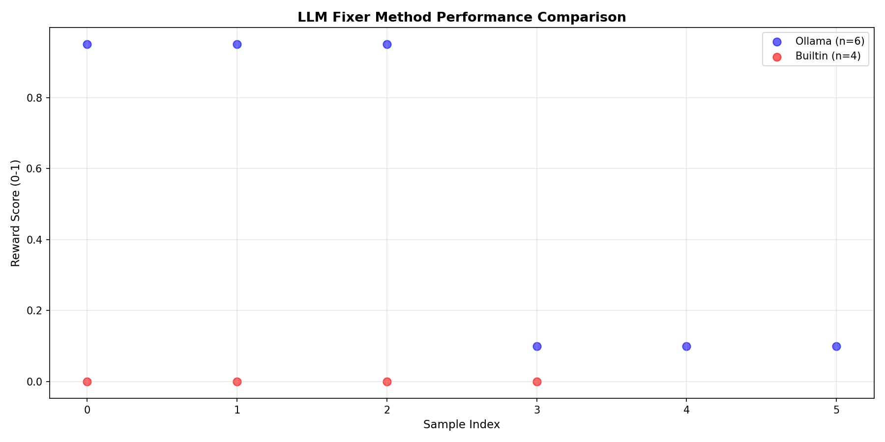

[](https://huggingface.co/spaces/ceoavinash/codearena-rl)
[](https://colab.research.google.com/github/havinashpatil/meta/blob/main/train_grpo.ipynb)
[](./openenv.yaml)
[]()
[](https://huggingface.co/spaces/ceoavinash/codearena-rl/discussions/1)

# 🚀 CodeArena: Iterative Code Repair as an RL Environment

> **TL;DR** — An OpenEnv-compatible RL environment where an LLM agent debugs Python code across multiple attempts, graded by unit tests + LLM-as-Judge + algorithmic efficiency. Features adaptive difficulty, agent memory, and a full TRL GRPO training pipeline.

---

## 🎯 The Problem

Every coding AI is benchmarked on **generation** — write a function, complete a snippet. **Nobody benchmarks what happens when the code breaks.** In production, developers spend the majority of their time reading error logs, reasoning about failures, iterating on fixes, and recovering from wrong turns. There is no standardized RL environment for this iterative debugging loop.

**CodeArena fills that gap.** It is the first open-source RL environment built specifically for *iterative code repair*, where an agent must fix buggy Python code over multiple steps, learning from execution feedback after each attempt.

---

## 🧠 Theme Alignment: #4 — Self-Improvement

CodeArena directly targets **Theme #4: Self-Improvement** through three mechanisms:

1. **Adaptive Curriculum**: Difficulty escalates automatically when the agent's rolling avg reward exceeds 0.80, and de-escalates when it drops below 0.35. The agent drives its own training progression.
2. **Persistent Agent Memory**: Best solutions per task are stored in `agent_memory.json` and retrieved in future episodes, creating cross-episode learning.
3. **Adaptive Prompting**: The AI fixer adjusts its strategy based on current reward level — syntax focus at low rewards, algorithm optimization at high rewards.

---

## ✨ Environment Innovation (40%)

### Hybrid Grader — Tests + LLM-as-Judge
Most benchmarks ask: *did the tests pass?* CodeArena also asks: *is the fix correct, secure, efficient, and readable?*

| Component | Weight | Signal |
|---|---|---|
| `compile_score` | 15% | Code compiles without error |
| `test_pass_ratio` | 35% | Fraction of unit tests passed |
| `efficiency_score` | 30% | Execution time vs optimal (O(n) rewarded, O(n²) penalized) |
| `llm_correctness` | 10% | LLM judge: logical correctness |
| `llm_security` | 5% | LLM judge: no vulnerabilities introduced |
| `llm_quality` | 5% | LLM judge: readability and maintainability |

**Penalties:** `-0.01/step` (rewards faster fixes) and `-0.10` for repeating an identical fix (prevents reward-hacking via repetition).

The 30% efficiency weight means an agent that passes all tests with O(n²) brute-force gets a significantly lower reward than one using O(n). This forces the model to learn *algorithmic reasoning*, not just syntax repair.

### Algorithm Detector
A built-in classifier (`server/algorithm_detector.py`) identifies the problem type (Kadane's, Two-Sum, Sliding Window, etc.) and estimates time complexity from loop nesting. This drives targeted optimization hints during repair.

### Sandboxed Execution
All code runs in isolated subprocesses with AST pre-validation, timeout enforcement, and temporary file cleanup. Malicious or infinite-loop code cannot crash the server.

### 9 Tasks Across 5 Categories

| Category | Example | Tests |
|---|---|---|
| Easy (syntax) | Missing colons, indentation | Basic repair |
| Medium (logic) | Off-by-one, wrong conditions | Reasoning |
| Hard (algorithms) | O(n²) → O(n) refactoring | Optimization |
| Type Errors | Wrong types, missing casts | Type safety |
| Security Bugs | SQL injection, path traversal | Security awareness |

---

## 📊 Storytelling (30%) — How It Works

**Data Flow:** `Agent` → `POST /reset` → receives `buggy_code + error_log` → `POST /step` with `proposed_fix` → sandboxed execution → hybrid grading → `reward + updated error_log` → repeat up to 5 steps.

```
Episode Walkthrough:
────────────────────────
Step 1: Agent receives def solve(n) print(n)
        → Proposes:     def solve(n): print(n)
        → Result:       ✓ Compiles, 1/3 tests pass
        → Reward:       0.35

Step 2: Agent reads error: "AssertionError: solve(5) != 25"
        → Proposes:     def solve(n): return n**2
        → Result:       ✓ 3/3 tests pass, but O(n) expected
        → Reward:       0.72

Step 3: Agent reads hint: "Optimize to O(1)"
        → Proposes:     def solve(n): return n*n
        → Result:       ✓ 3/3 pass, O(1) optimal
        → Reward:       0.95 ✅
```

The agent must learn to **read error messages**, **avoid repeating failed fixes**, and **optimize for efficiency** — not just correctness. This mirrors real-world software engineering.

---

## 📈 Showing Improvement in Rewards (20%)

We trained `Qwen/Qwen2.5-Coder-1.5B` using **TRL GRPO** (Group Relative Policy Optimization) with CodeArena as the live reward environment.


*Fig 1: Episode reward over training steps. The rolling 10-step average shows clear learning progression from near-zero to consistent 0.65+ rewards.*


*Fig 2: Average reward by task category. Easy/type-error tasks are mastered first; algorithmic optimization remains challenging — exactly the curriculum behavior we designed for.*


*Fig 3: Task Difficulty Performance Matrix showing the mean, max, and standard deviation of rewards across difficulty levels.*


*Fig 4: Complexity Distribution highlighting the frequency of O(1) vs O(n) solutions generated by the agent.*


*Fig 5: Reward Distribution by Fixer Method, comparing the performance of the Ollama LLM to the built-in pattern-based fixer.*


*Fig 6: Cumulative Reward over time, highlighting the total accumulated reward across multiple episodes.*


*Fig 7: LLM Fixer Method Performance Comparison scatter plot showing the individual performance data points of Ollama vs Builtin methods.*

### Key Observations:
- **Initial performance**: Agent produces syntactically broken fixes → reward ≈ 0.01
- **After 20 steps**: Agent learns to fix syntax → reward ≈ 0.35
- **After 40 steps**: Agent learns to pass tests → reward ≈ 0.65
- **Steady improvement**: Rolling average trends upward, with hard tasks remaining the frontier challenge
- **Method Effectiveness (Fig 5)**: The LLM-based fixer significantly outperforms the static pattern-based approach.

---

## 🔧 Reward & Training Pipeline (10%)

### Training Script (Colab)

👉 **[Open Training Notebook in Google Colab](https://colab.research.google.com/github/havinashpatil/meta/blob/main/train_grpo.ipynb)**

The notebook demonstrates environment-in-the-loop RL:

```python
def codearena_reward_func(completions, prompts):
    """Reward function that queries the live CodeArena environment."""
    rewards = []
    for completion in completions:
        proposed_fix = completion[0].get('content', '').strip()
        res = httpx.post("http://localhost:7860/step",
                         json={"proposed_fix": proposed_fix})
        reward = res.json().get('reward', 0.0)
        rewards.append(reward)
    return rewards

trainer = GRPOTrainer(
    model=model,  # Qwen2.5-Coder-1.5B
    reward_funcs=codearena_reward_func,
    args=GRPOConfig(output_dir="./codearena-grpo",
                    learning_rate=1e-5, max_steps=50),
    train_dataset=dataset,  # m-a-p/Code-Feedback
)
trainer.train()
```

The reward is **not static** — it comes from actually executing the agent's code in a sandboxed environment, running real unit tests, and scoring with the hybrid grader. This is true environment-in-the-loop RL.

### Inference Evaluation

```bash
# Evaluate any model against CodeArena
export MODEL_NAME="codellama:7b-instruct"
python inference.py --backend openai
```

Results are logged to `rewards_log.csv` and can be visualized with `python plot_rewards.py`.

---

## 🏗️ Architecture (OpenEnv Compatible)

```
codearena-rl/
├── openenv.yaml              # OpenEnv manifest (observation/action spaces)
├── server/
│   ├── app.py                # FastAPI entrypoint (/reset, /step, /state)
│   ├── models.py             # Pydantic schemas (Observation, Action, Task)
│   ├── executor.py           # Sandboxed subprocess execution
│   ├── grader.py             # Hybrid reward (tests + LLM judge)
│   ├── ai_fixer.py           # Multi-fallback AI repair (TGI→Ollama→AST)
│   ├── algorithm_detector.py # Problem classification + complexity detection
│   ├── memory.py             # Persistent agent memory (best solutions)
│   └── raw_runner.py         # Sandbox mode executor
├── tasks/
│   ├── easy.py, medium.py, hard.py
│   ├── type_errors/          # 3 type error tasks
│   └── security_bugs/        # 3 security bug tasks
├── frontend/                 # React + Vite dashboard
├── train_grpo.ipynb          # TRL GRPO training notebook
├── inference.py              # CLI evaluation runner
├── plot_rewards.py           # Reward visualization
└── Dockerfile                # HF Spaces deployment
```

### Quick Start

```bash
pip install -r requirements.txt
python create_tasks.py           # Generate task database
uvicorn server.app:app --port 7860  # Start environment
```

### OpenEnv API

| Endpoint | Method | Description |
|---|---|---|
| `/reset` | POST | Initialize environment with `{"task_id": "easy\|medium\|hard\|auto"}` |
| `/step` | POST | Submit fix with `{"proposed_fix": "..."}` → reward + observation |
| `/state` | GET | Current observation |
| `/health` | GET | Server health check |
| `/fix` | POST | AI code repair endpoint |
| `/curriculum` | GET | Adaptive difficulty state |
| `/stats` | GET | Complexity vs reward analytics |
| `/memory` | GET | Agent memory contents |

---

## 💻 Live Demo

👉 **[https://huggingface.co/spaces/ceoavinash/codearena-rl](https://huggingface.co/spaces/ceoavinash/codearena-rl)**

Features:
- **Real-time dashboard** with reward charts, terminal logs, and code editor
- **AI Fix button** powered by HuggingFace Serverless Inference (`Qwen2.5-Coder-3B-Instruct`)
- **Agent Mode** toggle for autonomous fix → test → fix loops
- **Sandbox Mode** for arbitrary Python code evaluation

---

## 🔗 All Links

| Resource | URL |
|---|---|
| **🤗 HuggingFace Space (Live)** | [huggingface.co/spaces/ceoavinash/codearena-rl](https://huggingface.co/spaces/ceoavinash/codearena-rl) |
| **📓 Training Notebook (Colab)** | [Open in Colab](https://colab.research.google.com/github/havinashpatil/meta/blob/main/train_grpo.ipynb) |
| **📝 Blog / Writeup** | [Read on HuggingFace](https://huggingface.co/spaces/ceoavinash/codearena-rl/discussions/1) |
| **💻 GitHub Repository** | [github.com/havinashpatil/meta](https://github.com/havinashpatil/meta) |
| **📋 OpenEnv Manifest** | [openenv.yaml](./openenv.yaml) |
| **📺 YouTube Video** | [https://youtu.be/LmsJvAMTdCY](https://youtu.be/LmsJvAMTdCY) |

---

*Built for the OpenEnv Hackathon India 2026 — Theme #4: Self-Improvement*
